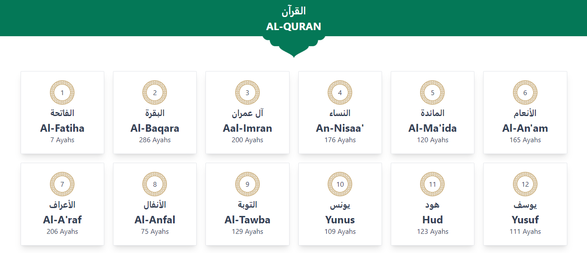

# Al-Quran

## 🔴[LIVE DEMO](https://piprahut.vercel.app/)

### Home Page



### Cart Page

### 🛠 Dependency used:-

- React Js
- react-router-dom
- react-icons
- Tailwind CSS

### Run Locally:-

Clone the project

```bash
  git clone https://github.com/mhhasanmehedi/al-quran
```

Go to the project directory

```bash
  cd al-quran
```

Install dependencies

```bash
  npm install
```

Start the server

```bash
  npm start
```

### 🔗 Follow Me:-

[](https://mehedihasanrahat.vercel.app/)
[](https://www.linkedin.com/in/mhhasanmehedi/)
[](https://twitter.com/mhhasanmehedi)
